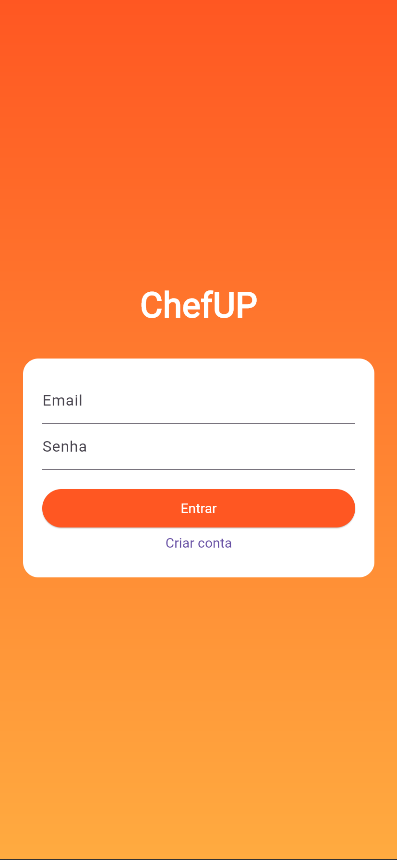
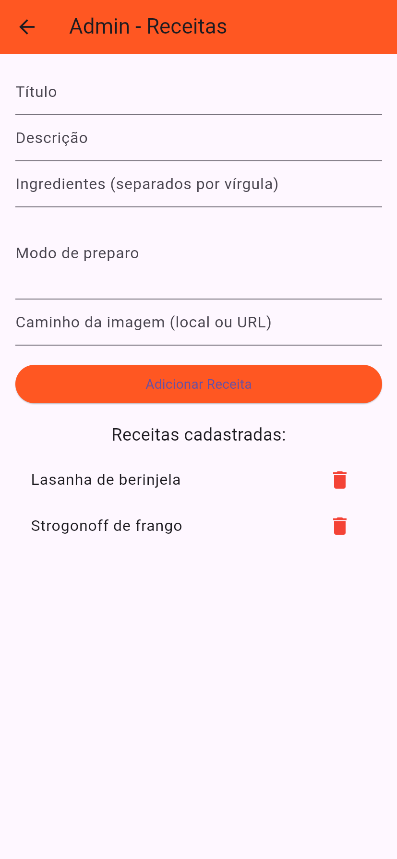

# 🍽️ ChefUP - App de Receitas com Flutter e Firebase

ChefUP é um aplicativo mobile feito em **Flutter**, com autenticação e banco de dados usando **Firebase**, onde usuários podem:

- 📖 Visualizar receitas populares
- ❤️ Favoritar suas receitas preferidas
- 🔐 Fazer login e cadastro com email e senha
- 👤 Ver e editar seu perfil (inclusive redefinir a senha)
- 🛠️ Administrar novas receitas (modo admin)

---

## 📱 Screenshots






---

## 🚀 Funcionalidades

- 🔍 **Busca** de receitas em tempo real
- ⭐ **Favoritar/Desfavoritar** receitas com animação
- 📷 Exibição de **imagem da receita**
- 📋 Tela de **detalhes da receita** com ingredientes e modo de preparo
- 🧑‍🍳 Tela de **admin** para adicionar receitas (modo desenvolvedor)
- 🔐 Integração com **Firebase Authentication**
- ☁️ Armazenamento de receitas e favoritos no **Firebase Firestore**
- 👤 Tela de **perfil com dados e opção de alterar senha**

---

## 🛠️ Tecnologias usadas

- Flutter 3.x
- Firebase Authentication
- Cloud Firestore
- Dart
- Firebase Core
- Firebase UI

---

## 🧪 Estrutura de pastas

```plaintext
lib/
├── main.dart
├── telas/
│   ├── tela_login.dart
│   ├── tela_cadastro.dart
│   ├── tela_inicial.dart
│   ├── tela_detalhes.dart
│   ├── tela_favoritos.dart
│   ├── tela_admin.dart
│   └── tela_perfil.dart
```


# 🚀 Como Rodar o Projeto ChefUP (Flutter + Firebase)

## 📦 Pré-requisitos

Antes de tudo, você precisa ter:

- ✅ [Flutter instalado](https://docs.flutter.dev/get-started/install)
- ✅ Conta no [Firebase Console](https://console.firebase.google.com/)
- ✅ Android Studio ou VS Code configurado com Flutter SDK

---

## 🔧 Passos para rodar

### 1. Clone o repositório

```bash
git clone https://github.com/seu-usuario/nome-do-repositorio.git
cd nome-do-repositorio
```

### 2. Instale as dependências do projeto

```bash
flutter pub get
```

### 3. Configure o Firebase

#### 🔹 Android

- No Firebase Console, crie um novo projeto.
- Registre seu app Android (ex: `com.seuapp.chefup`).
- Baixe o arquivo `google-services.json`.
- Coloque esse arquivo em:
  `android/app/google-services.json`

#### 🔹 iOS (opcional)

- Registre seu app iOS no Firebase.
- Baixe o arquivo `GoogleService-Info.plist`.
- Adicione em:
  `ios/Runner/GoogleService-Info.plist`

---

### 4. Ative os serviços no Firebase

No painel do Firebase:

- Vá em **Authentication** → Habilite **"Email e Senha"**.
- Vá em **Firestore Database** → Crie um banco no modo de teste.
- (Opcional) Vá em **Storage** se quiser armazenar imagens.

---

### 5. Rode o app

Conecte um celular ou use um emulador, e execute:

```bash
flutter run
```
