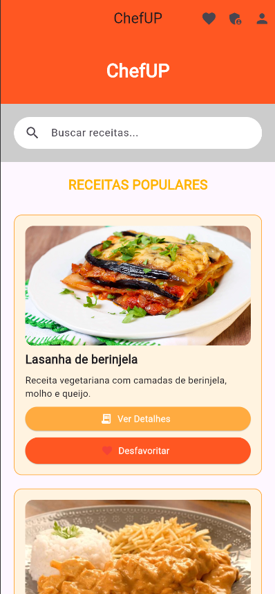

# 🍽️ ChefUP - App de Receitas com Flutter e Firebase

ChefUP é um aplicativo mobile feito em **Flutter**, com autenticação e banco de dados usando **Firebase**, onde usuários podem:

- 📖 Visualizar receitas populares
- ❤️ Favoritar suas receitas preferidas
- 🔐 Fazer login e cadastro com email e senha
- 👤 Ver e editar seu perfil (inclusive redefinir a senha)
- 🛠️ Administrar novas receitas (modo admin)

---

## 📱 Screenshots





---

## 🚀 Funcionalidades

- 🔍 **Busca** de receitas em tempo real
- ⭐ **Favoritar/Desfavoritar** receitas com animação
- 📷 Exibição de **imagem da receita**
- 📋 Tela de **detalhes da receita** com ingredientes e modo de preparo
- 🧑‍🍳 Tela de **admin** para adicionar receitas (modo desenvolvedor)
- 🔐 Integração com **Firebase Authentication**
- ☁️ Armazenamento de receitas e favoritos no **Firebase Firestore**
- 👤 Tela de **perfil com dados e opção de alterar senha**

---

## 🛠️ Tecnologias usadas

- Flutter 3.x
- Firebase Authentication
- Cloud Firestore
- Dart
- Firebase Core
- Firebase UI

---

## 🧪 Estrutura de pastas

```plaintext
lib/
├── main.dart
├── telas/
│   ├── tela_login.dart
│   ├── tela_cadastro.dart
│   ├── tela_inicial.dart
│   ├── tela_detalhes.dart
│   ├── tela_favoritos.dart
│   ├── tela_admin.dart
│   └── tela_perfil.dart
```
